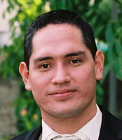

## Abstract

Since the celebrated book by Rasmussen and Williams, there have been a considerable amount of novel contributions that are allowing the applicability of Gaussian processes (GPs) to problems at an unprecedented scale and to new areas where uncertainty quantification is of fundamental importance. 
This tutorial will expose attendees to recent advances in GP research; describe the current challenges in modeling and inference with GPs; their relationship to neural networks and deep neural networks and stimulate the debate about the role of GP models in solving complex machine-learning tasks. 

## Table of Content

* [Presenters](#presenters)
* [Link to Slides](#link-to-slides)
* [Notebooks](#notebooks)
* [Acknowledgements](#acknowledgements)
* [References](#references)

## Presenters

<b><a href="http://ebonilla.github.io" target="_blank">Edwin V. Bonilla</a></b>

Edwin V. Bonilla received a Master&#39;s degree in Artificial Intelligence and a PhD in Informatics at the University of Edinburgh (UK) in 2004 and 2008, respectively. 

He worked at the University of Edinburgh as a Research Associate from 2008 to 2009. He then moved to National ICT Australia  as a machine-learning researcher, while also being an adjunct research fellow at the Australian National University (2010-2014). He worked as a Senior Lecturer at UNSW Sydney from 2014 to 2018. He now works as a principal research scientist at CSIRO's Data61 (Australia). 

Edwin's more recent work and interests are in the areas of generic and efficient inference for models with Gaussian process priors and general likelihoods; deep Gaussian processes; probabilistic methods for network-structure discovery; doubly stochastic Poisson process models; graph neural networks; and inference in implicit probabilistic models.

<b><a href="http://www.eurecom.fr/~filippon/index.html" target="_blank">Maurizio Filippone</a></b>

Maurizio Filippone received a Master&#39;s degree in Physics and a Ph.D. in Computer Science from the University of Genova, Italy, in 2004 and 2008, respectively. 

In 2007, he was a Research Scholar with George Mason University, Fairfax, VA. 
  From 2008 to 2011, he was a Research Associate with the University of Sheffield, U.K. (2008-2009), with the University of Glasgow, U.K. (2010), and with University College London, U.K (2011). 
  From 2011 to 2015 he was a Lecturer at the University of Glasgow, U.K, and he is currently AXA Chair of Computational Statistics and Associate Professor at EURECOM, Sophia Antipolis, France. 

  His current research interests include the development of tractable and scalable Bayesian inference techniques for nonparametric statistical models with applications in environmental and life sciences.

## Link to Slides

* [Introduction](slides/introduction.pdf)
* [Definition of Gaussian Processes](slides/gaussian_processes.pdf)
* [Model Approximations](slides/model_approximations.pdf)
* [Inference](slides/inference.pdf)
* [Challenges](slides/challenges.pdf)
* [Theory and Code](slides/theory_code.pdf)

## Notebooks

[Notebook Sampling from GP prior](notebooks/gp-priors.ipynb)

[Notebook on GP Regression](notebooks/gp-inference.ipynb)

## Acknowledgements

We would like to thank Simone Rossi and Jonas Wacker for their help in preparing the jupyter notebooks.

## References

<link rel="import" href="references/references.html">

* [Bayesian Deep Nets and Deep Gaussian Processes](#bayesian-deep-nets-and-deep-gaussian-processes)

* [Inference for Deep Gaussian Processes](#inference-for-deep-gaussian-processes)

* [Convolutional Nets and Gaussian Processes](#convolutional-nets-and-gaussian-processes)

* [Bayesian Convolutional Nets](#bayesian-convolutional-nets)

* [Calibration of Bayesian Convolutional Nets](#calibration-of-bayesian-convolutional-nets)

* [Random Feature Expansions for Shallow and Deep Gaussian Processes](#random-feature-expansions-for-shallow-and-deep-gaussian-processes)

* [Variational Inference](#variational-inference)

* [Variational Inference for Gaussian Process Models](#variational-inference-gps)

* [Unsupervised learning with Deep Gaussian Processes](#unsupervised-learning-with-deep-gaussian-processes)

* [Multi-task Learning with Gaussian Processes](#mtl-gps)

* [Bayesian Optimization](#bo)

* [Other GP and DGP Models](#other-gp-dgp-models)

### Bayesian Deep Nets and Deep Gaussian Processes
<ul>

<li>

A.&nbsp;G. de&nbsp;G.&nbsp;Matthews, J.&nbsp;Hron, M.&nbsp;Rowland, R.&nbsp;E. Turner, and Z.&nbsp;Ghahramani.
 Gaussian process behaviour in wide deep neural networks.
 In <em>International Conference on Learning Representations</em>, 2018.

</li>

<li>

K.&nbsp;Cutajar, E.&nbsp;V. Bonilla, P.&nbsp;Michiardi, and M.&nbsp;Filippone.
 Random feature expansions for deep Gaussian processes.
 In D.&nbsp;Precup and Y.&nbsp;W. Teh, editors, <em>Proceedings of the 34th
  International Conference on Machine Learning</em>, volume&nbsp;70 of <em>Proceedings
  of Machine Learning Research</em>, pages 884--893, International Convention
  Centre, Sydney, Australia, Aug. 2017. PMLR.

</li>

<li>

Y.&nbsp;Gal and Z.&nbsp;Ghahramani.
 Dropout As a Bayesian Approximation: Representing Model Uncertainty
  in Deep Learning.
 In <em>Proceedings of the 33rd International Conference on
  International Conference on Machine Learning - Volume 48</em>, ICML'16, pages
  1050--1059. JMLR.org, 2016.

</li>

<li>

D.&nbsp;K. Duvenaud, O.&nbsp;Rippel, R.&nbsp;P. Adams, and Z.&nbsp;Ghahramani.
 Avoiding pathologies in very deep networks.
 In <em>Proceedings of the Seventeenth International Conference on
  Artificial Intelligence and Statistics, AISTATS 2014, Reykjavik, Iceland,
  April 22-25, 2014</em>, volume&nbsp;33 of <em>JMLR Workshop and Conference
  Proceedings</em>, pages 202--210. JMLR.org, 2014.

</li>

<li>

R.&nbsp;M. Neal.
 <em>Bayesian Learning for Neural Networks (Lecture Notes in
  Statistics)</em>.
 Springer, 1 edition, Aug. 1996.

</li></ul>
### Inference for Deep Gaussian Processes
<ul>

<li>

H.&nbsp;Salimbeni and M.&nbsp;Deisenroth.
 Doubly Stochastic Variational Inference for Deep Gaussian
  Processes.
 In I.&nbsp;Guyon, U.&nbsp;V. Luxburg, S.&nbsp;Bengio, H.&nbsp;Wallach, R.&nbsp;Fergus,
  S.&nbsp;Vishwanathan, and R.&nbsp;Garnett, editors, <em>Advances in Neural Information
  Processing Systems 30</em>, pages 4588--4599. Curran Associates, Inc., 2017.

</li>

<li>

M.&nbsp;D. Hoffman.
 Learning deep latent Gaussian models with Markov chain Monte
  Carlo.
 In D.&nbsp;Precup and Y.&nbsp;W. Teh, editors, <em>Proceedings of the 34th
  International Conference on Machine Learning</em>, volume&nbsp;70 of <em>Proceedings
  of Machine Learning Research</em>, pages 1510--1519, International Convention
  Centre, Sydney, Australia, Aug. 2017. PMLR.

</li>

<li>

M.&nbsp;Havasi, J.&nbsp;M. Hern&aacute;ndez-Lobato, and J.&nbsp;J. Murillo-Fuentes.
 Inference in Deep Gaussian Processes using Stochastic Gradient
  Hamiltonian Monte Carlo.
 In S.&nbsp;Bengio, H.&nbsp;Wallach, H.&nbsp;Larochelle, K.&nbsp;Grauman, N.&nbsp;Cesa-Bianchi,
  and R.&nbsp;Garnett, editors, <em>Advances in Neural Information Processing
  Systems 31</em>, pages 7506--7516. Curran Associates, Inc., 2018.

</li>

<li>

K.&nbsp;Cutajar, E.&nbsp;V. Bonilla, P.&nbsp;Michiardi, and M.&nbsp;Filippone.
 Random feature expansions for deep Gaussian processes.
 In D.&nbsp;Precup and Y.&nbsp;W. Teh, editors, <em>Proceedings of the 34th
  International Conference on Machine Learning</em>, volume&nbsp;70 of <em>Proceedings
  of Machine Learning Research</em>, pages 884--893, International Convention
  Centre, Sydney, Australia, Aug. 2017. PMLR.

</li>

<li>

T.&nbsp;D. Bui, D.&nbsp;Hern&aacute;ndez-Lobato, J.&nbsp;M. Hern&aacute;ndez-Lobato, Y.&nbsp;Li, and
  R.&nbsp;E. Turner.
 Deep Gaussian Processes for Regression using Approximate Expectation
  Propagation.
 In M.-F. Balcan and K.&nbsp;Q. Weinberger, editors, <em>Proceedings of
  the 33nd International Conference on Machine Learning, ICML 2016, New York
  City, NY, USA, June 19-24, 2016</em>, volume&nbsp;48, pages 1472--1481. JMLR.org,
  2016.

</li>

<li>

A.&nbsp;C. Damianou and N.&nbsp;D. Lawrence.
 Deep Gaussian Processes.
 In <em>Proceedings of the Sixteenth International Conference on
  Artificial Intelligence and Statistics, AISTATS 2013, Scottsdale, AZ, USA,
  April 29 - May 1, 2013</em>, volume&nbsp;31 of <em>JMLR Proceedings</em>, pages
  207--215. JMLR.org, 2013.

</li>

<li>

J.&nbsp;Hensman and N.&nbsp;D. Lawrence.
 Nested Variational Compression in Deep Gaussian Processes, Dec.
  2014.
 arxiv:1412.1370.

</li></ul>
### Convolutional Nets and Gaussian Processes
<ul>

<li>

V.&nbsp;Kumar, V.&nbsp;Singh, P.&nbsp;K. Srijith, and A.&nbsp;Damianou.
 Deep Gaussian Processes with Convolutional Kernels, June 2018.
 arXiv:1806.01655.

</li>

<li>

M.&nbsp;van&nbsp;der Wilk, C.&nbsp;E. Rasmussen, and J.&nbsp;Hensman.
 Convolutional Gaussian Processes.
 In I.&nbsp;Guyon, U.&nbsp;V. Luxburg, S.&nbsp;Bengio, H.&nbsp;Wallach, R.&nbsp;Fergus,
  S.&nbsp;Vishwanathan, and R.&nbsp;Garnett, editors, <em>Advances in Neural Information
  Processing Systems 30</em>, pages 2849--2858. Curran Associates, Inc., 2017.

</li>

<li>

J.&nbsp;Bradshaw, Alexander, and Z.&nbsp;Ghahramani.
 Adversarial Examples, Uncertainty, and Transfer Testing Robustness
  in Gaussian Process Hybrid Deep Networks, July 2017.
 arXiv:1707.02476.

</li>

<li>

R.&nbsp;Calandra, J.&nbsp;Peters, C.&nbsp;E. Rasmussen, and M.&nbsp;P. Deisenroth.
 Manifold Gaussian Processes for regression.
 In <em>2016 International Joint Conference on Neural Networks,
  IJCNN 2016, Vancouver, BC, Canada, July 24-29, 2016</em>, pages 3338--3345,
  2016.

</li>

<li>

A.&nbsp;G. Wilson, Z.&nbsp;Hu, R.&nbsp;R. Salakhutdinov, and E.&nbsp;P. Xing.
 Stochastic Variational Deep Kernel Learning.
 In D.&nbsp;D. Lee, M.&nbsp;Sugiyama, U.&nbsp;V. Luxburg, I.&nbsp;Guyon, and R.&nbsp;Garnett,
  editors, <em>Advances in Neural Information Processing Systems 29</em>, pages
  2586--2594. Curran Associates, Inc., 2016.

</li></ul>
### Bayesian Convolutional Nets
<ul>

<li>

G.-L. Tran, E.&nbsp;V. Bonilla, J.&nbsp;Cunningham, P.&nbsp;Michiardi, and M.&nbsp;Filippone.
 Calibrating Deep Convolutional Gaussian Processes.
 In K.&nbsp;Chaudhuri and M.&nbsp;Sugiyama, editors, <em>Proceedings of Machine
  Learning Research</em>, volume&nbsp;89 of <em>Proceedings of Machine Learning
  Research</em>, pages 1554--1563. PMLR, 16--18 Apr 2019.

</li>

<li>

F.&nbsp;Laumann, K.&nbsp;Shridhar, and A.&nbsp;L. Maurin.
 Bayesian Convolutional Neural Networks, June 2018.
 arXiv:1806.05978.

</li>

<li>

A.&nbsp;Garriga-Alonso, C.&nbsp;E. Rasmussen, and L.&nbsp;Aitchison.
 Deep Convolutional Networks as shallow Gaussian Processes.
 In <em>International Conference on Learning Representations</em>, 2019.

</li>

<li>

Y.&nbsp;Gal and Z.&nbsp;Ghahramani.
 Bayesian convolutional neural networks with Bernoulli approximate
  variational inference.
 In <em>4th International Conference on Learning Representations
  (ICLR) workshop track</em>, 2016.

</li></ul>
### Calibration of Bayesian Convolutional Nets
<ul>

<li>

G.-L. Tran, E.&nbsp;V. Bonilla, J.&nbsp;Cunningham, P.&nbsp;Michiardi, and M.&nbsp;Filippone.
 Calibrating Deep Convolutional Gaussian Processes.
 In K.&nbsp;Chaudhuri and M.&nbsp;Sugiyama, editors, <em>Proceedings of Machine
  Learning Research</em>, volume&nbsp;89 of <em>Proceedings of Machine Learning
  Research</em>, pages 1554--1563. PMLR, 16--18 Apr 2019.

</li>

<li>

B.&nbsp;Lakshminarayanan, A.&nbsp;Pritzel, and C.&nbsp;Blundell.
 Simple and Scalable Predictive Uncertainty Estimation using Deep
  Ensembles.
 In I.&nbsp;Guyon, U.&nbsp;V. Luxburg, S.&nbsp;Bengio, H.&nbsp;Wallach, R.&nbsp;Fergus,
  S.&nbsp;Vishwanathan, and R.&nbsp;Garnett, editors, <em>Advances in Neural Information
  Processing Systems 30</em>, pages 6402--6413. Curran Associates, Inc., 2017.

</li>

<li>

A.&nbsp;Niculescu-Mizil and R.&nbsp;Caruana.
 Predicting Good Probabilities with Supervised Learning.
 In <em>Proceedings of the 22Nd International Conference on Machine
  Learning</em>, ICML '05, pages 625--632, New York, NY, USA, 2005. ACM.

</li>

<li>

C.&nbsp;Guo, G.&nbsp;Pleiss, Y.&nbsp;Sun, and K.&nbsp;Q. Weinberger.
 On Calibration of Modern Neural Networks.
 In D.&nbsp;Precup and Y.&nbsp;W. Teh, editors, <em>Proceedings of the 34th
  International Conference on Machine Learning</em>, volume&nbsp;70 of <em>Proceedings
  of Machine Learning Research</em>, pages 1321--1330, International Convention
  Centre, Sydney, Australia, Aug. 2017. PMLR.

</li></ul>
### Random Feature Expansions for Shallow and Deep Gaussian Processes
<ul>

<li>

K.&nbsp;Cutajar, E.&nbsp;V. Bonilla, P.&nbsp;Michiardi, and M.&nbsp;Filippone.
 Random feature expansions for deep Gaussian processes.
 In D.&nbsp;Precup and Y.&nbsp;W. Teh, editors, <em>Proceedings of the 34th
  International Conference on Machine Learning</em>, volume&nbsp;70 of <em>Proceedings
  of Machine Learning Research</em>, pages 884--893, International Convention
  Centre, Sydney, Australia, Aug. 2017. PMLR.

</li>

<li>

F.&nbsp;X. Yu, A.&nbsp;T. Suresh, K.&nbsp;M. Choromanski, D.&nbsp;N. Holtmann-Rice, and S.&nbsp;Kumar.
 Orthogonal Random Features.
 In D.&nbsp;D. Lee, M.&nbsp;Sugiyama, U.&nbsp;V. Luxburg, I.&nbsp;Guyon, and R.&nbsp;Garnett,
  editors, <em>Advances in Neural Information Processing Systems 29</em>, pages
  1975--1983. Curran Associates, Inc., 2016.

</li>

<li>

Q.&nbsp;Le, T.&nbsp;Sarlos, and A.&nbsp;Smola.
 Fastfood - Approximating Kernel Expansions in Loglinear Time.
 In <em>30th International Conference on Machine Learning (ICML)</em>,
  2013.

</li>

<li>

Y.&nbsp;Gal and Z.&nbsp;Ghahramani.
 Dropout As a Bayesian Approximation: Representing Model Uncertainty
  in Deep Learning.
 In <em>Proceedings of the 33rd International Conference on
  International Conference on Machine Learning - Volume 48</em>, ICML'16, pages
  1050--1059. JMLR.org, 2016.

</li>

<li>

A.&nbsp;Rahimi and B.&nbsp;Recht.
 Random Features for Large-Scale Kernel Machines.
 In J.&nbsp;C. Platt, D.&nbsp;Koller, Y.&nbsp;Singer, and S.&nbsp;T. Roweis, editors, <em>
  Advances in Neural Information Processing Systems 20</em>, pages 1177--1184.
  Curran Associates, Inc., 2008.

</li></ul>
### Variational Inference
<ul>

<li>

D.&nbsp;P. Kingma and M.&nbsp;Welling.
 Auto-Encoding Variational Bayes.
 In <em>Proceedings of the Second International Conference on
  Learning Representations (ICLR 2014)</em>, Apr. 2014.

</li>

<li>

A.&nbsp;Graves.
 Practical Variational Inference for Neural Networks.
 In J.&nbsp;Shawe-Taylor, R.&nbsp;S. Zemel, P.&nbsp;L. Bartlett, F.&nbsp;Pereira, and
  K.&nbsp;Q. Weinberger, editors, <em>Advances in Neural Information Processing
  Systems 24</em>, pages 2348--2356. Curran Associates, Inc., 2011.

</li></ul>
### Variational Inference for Gaussian Process Models
<ul>

<li>

T.&nbsp;V. Nguyen and E.&nbsp;V. Bonilla.
 Automated variational inference for Gaussian process models.
 In <em>Advances in Neural Information Processing Systems</em>. 2014.

</li>

<li>

J.&nbsp;Hensman, N.&nbsp;Fusi, and N.&nbsp;D. Lawrence.
 Gaussian processes for big data.
 In <em>Uncertainty in Artificial Intelligence</em>, 2013.

</li>

<li>

A.&nbsp;Dezfouli and E.&nbsp;V. Bonilla.
 Scalable inference for Gaussian process models with black-box
  likelihoods.
 In <em>Advances in Neural Information Processing Systems</em>. 2015.

</li>

<li>

E.&nbsp;V. Bonilla, K.&nbsp;Krauth, and A.&nbsp;Dezfouli.
 Generic Inference in Latent Gaussian Process Models.
 <em>arXiv e-prints</em>, page arXiv:1609.00577, Sep 2016.

</li>

<li>

M.&nbsp;Titsias.
 Variational learning of inducing variables in sparse Gaussian
  processes.
 In <em>Artificial Intelligence and Statistics</em>, 2009.

</li>

<li>

K.&nbsp;Krauth, E.&nbsp;V. Bonilla, K.&nbsp;Cutajar, and M.&nbsp;Filippone.
 AutoGP: Exploring the capabilities and limitations of gaussian
  process models.
 In <em>Uncertainty in Artificial Intelligence</em>, 2017.

</li></ul>
### Unsupervised learning with Deep Gaussian Processes
<ul>

<li>

R.&nbsp;Domingues, P.&nbsp;Michiardi, J.&nbsp;Zouaoui, and M.&nbsp;Filippone.
 Deep Gaussian process autoencoders for novelty detection.
 <em>Machine Learning</em>, 107(8-10):1363--1383, 2018.

</li>

<li>

Z.&nbsp;Dai, A.&nbsp;Damianou, J.&nbsp;Gonz&aacute;lez, and N.&nbsp;Lawrence.
 Variational Auto-encoded Deep Gaussian Processes, Feb. 2016.

</li>

<li>

N.&nbsp;Lawrence.
 Probabilistic non-linear principal component analysis with Gaussian
  process latent variable models.
 6:1783--1816, 2005.

</li>

<li>

K.&nbsp;Grochow, S.&nbsp;L. Martin, A.&nbsp;Hertzmann, and Z.&nbsp;Popovi&#x107;.
 Style-based inverse kinematics.
 In <em>ACM SIGGRAPH 2004 Papers</em>, SIGGRAPH '04, pages 522--531, New
  York, NY, USA, 2004. ACM.

</li></ul>
### Multi-task Learning with Gaussian Processes
<ul>

<li>

K.&nbsp;M.&nbsp;A. Chai, C.&nbsp;K. Williams, S.&nbsp;Klanke, and S.&nbsp;Vijayakumar.
 Multi-task Gaussian process learning of robot inverse dynamics.
 In <em>Advances in Neural Processing Systems</em>, pages 265--272, 2008.

</li>

<li>

E.&nbsp;V. Bonilla, K.&nbsp;M.&nbsp;A. Chai, and C.&nbsp;K.&nbsp;I. Williams.
 Multi-task Gaussian process prediction.
 In <em>Advances in Neural Processing Systems</em>, 2008.

</li>

<li>

M.&nbsp;A. &Aacute;lvarez and N.&nbsp;D. Lawrence.
 Computationally efficient convolved multiple output Gaussian
  processes.
 12(5):1459--1500, 2011.

</li>

<li>

A.&nbsp;G. Wilson, D.&nbsp;A. Knowles, and Z.&nbsp;Ghahramani.
 Gaussian process regression networks.
 In <em>International Conference on Machine Learning</em>, 2012.

</li>

<li>

P.&nbsp;Boyle.
 <em>Gaussian Processes for Regression and Optimisation</em>.
 PhD thesis, Victoria University of Wellington, 2007.

</li></ul>
### Bayesian Optimization
<ul>

<li>

D.&nbsp;R. Jones.
 A Taxonomy of Global Optimization Methods Based on Response
  Surfaces.
 <em>Journal of Global Optimization</em>, 21(4):345--383, 2001.

</li>

<li>

J.&nbsp;Snoek, H.&nbsp;Larochelle, and R.&nbsp;P. Adams.
 Practical bayesian optimization of machine learning algorithms.
 In <em>Advances in neural information processing systems</em>, pages
  2951--2959, 2012.

</li>

<li>

W.&nbsp;Chu and Z.&nbsp;Ghahramani.
 Preference learning with gaussian processes.
 In <em>Proceedings of the 22nd international conference on Machine
  learning</em>, pages 137--144. ACM, 2005.

</li>

<li>

K.&nbsp;Swersky, J.&nbsp;Snoek, and R.&nbsp;P. Adams.
 Multi-task bayesian optimization.
 In <em>Advances in neural information processing systems</em>, pages
  2004--2012, 2013.

</li></ul>
### Other GP and DGP Models
<ul>

<li>

R.&nbsp;Domingues, P.&nbsp;Michiardi, J.&nbsp;Zouaoui, and M.&nbsp;Filippone.
 Deep Gaussian process autoencoders for novelty detection.
 <em>Machine Learning</em>, 107(8-10):1363--1383, 2018.

</li>

<li>

M.&nbsp;van&nbsp;der Wilk, C.&nbsp;E. Rasmussen, and J.&nbsp;Hensman.
 Convolutional Gaussian Processes.
 In I.&nbsp;Guyon, U.&nbsp;V. Luxburg, S.&nbsp;Bengio, H.&nbsp;Wallach, R.&nbsp;Fergus,
  S.&nbsp;Vishwanathan, and R.&nbsp;Garnett, editors, <em>Advances in Neural Information
  Processing Systems 30</em>, pages 2849--2858. Curran Associates, Inc., 2017.

</li>

<li>

M.&nbsp;Lorenzi, M.&nbsp;Filippone, G.&nbsp;B. Frisoni, D.&nbsp;C. Alexander, and S.&nbsp;Ourselin.
 Probabilistic disease progression modeling to characterize diagnostic
  uncertainty: staging and prediction in Alzheimer's disease.
 <em>NeuroImage</em>, 2017.
 to appear.

</li>

<li>

Z.&nbsp;Dai, A.&nbsp;Damianou, J.&nbsp;Gonz&aacute;lez, and N.&nbsp;Lawrence.
 Variational Auto-encoded Deep Gaussian Processes, Feb. 2016.

</li>

<li>

K.&nbsp;Blomqvist, S.&nbsp;Kaski, and M.&nbsp;Heinonen.
 Deep convolutional gaussian processes.
 <em>arXiv preprint arXiv:1810.03052</em>, 2018.

</li>

<li>

P.&nbsp;Galliani, A.&nbsp;Dezfouli, E.&nbsp;Bonilla, and N.&nbsp;Quadrianto.
 Gray-box inference for structured Gaussian process models.
 In A.&nbsp;Singh and J.&nbsp;Zhu, editors, <em>Proceedings of the 20th
  International Conference on Artificial Intelligence and Statistics</em>,
  volume&nbsp;54 of <em>Proceedings of Machine Learning Research</em>, pages 353--361,
  Fort Lauderdale, FL, USA, 20--22 Apr 2017. PMLR.

</li>

<li>

S.&nbsp;Linderman and R.&nbsp;Adams.
 Discovering latent network structure in point process data.
 In <em>International Conference on Machine Learning</em>, pages
  1413--1421, 2014.

</li>

<li>

A.&nbsp;Dezfouli, E.&nbsp;Bonilla, and R.&nbsp;Nock.
 Variational network inference: Strong and stable with concrete
  support.
 In J.&nbsp;Dy and A.&nbsp;Krause, editors, <em>Proceedings of the 35th
  International Conference on Machine Learning</em>, volume&nbsp;80 of <em>Proceedings
  of Machine Learning Research</em>, pages 1204--1213, Stockholmsmässan, Stockholm
  Sweden, 10--15 Jul 2018. PMLR.

</li>

<li>

M.&nbsp;Kuss and C.&nbsp;E. Rasmussen.
 Gaussian processes in reinforcement learning.
 In <em>Advances in neural information processing systems</em>, pages
  751--758, 2004.

</li>

<li>

Y.&nbsp;Engel, S.&nbsp;Mannor, and R.&nbsp;Meir.
 Reinforcement learning with gaussian processes.
 In <em>Proceedings of the 22nd international conference on Machine
  learning</em>, pages 201--208. ACM, 2005.

</li>

<li>

M.&nbsp;Deisenroth and C.&nbsp;E. Rasmussen.
 Pilco: A model-based and data-efficient approach to policy search.
 In <em>Proceedings of the 28th International Conference on machine
  learning (ICML-11)</em>, pages 465--472, 2011.

</li>

<li>

J.&nbsp;Martin and B.&nbsp;Englot.
 Recursive sparse pseudo-input gaussian process sarsa.
 <em>arXiv preprint arXiv:1811.07201</em>, 2018.

</li>

<li>

R.&nbsp;P. Adams, I.&nbsp;Murray, and D.&nbsp;J. MacKay.
 Tractable nonparametric bayesian inference in poisson processes with
  gaussian process intensities.
 In <em>Proceedings of the 26th Annual International Conference on
  Machine Learning</em>, pages 9--16. ACM, 2009.

</li>

<li>

C.&nbsp;Lloyd, T.&nbsp;Gunter, M.&nbsp;A. Osborne, and S.&nbsp;J. Roberts.
 Variational Inference for Gaussian Process Modulated Poisson
  Processes.
 In <em>International Conference on Machine Learning</em>, 2015.

</li>

<li>

S.&nbsp;John and J.&nbsp;Hensman.
 Large-scale cox process inference using variational fourier features.
 <em>International Conference on Machine Learning</em>, 2018.

</li>

<li>

V.&nbsp;Aglietti, T.&nbsp;Damoulas, and E.&nbsp;Bonilla.
 Efficient inference in multi-task cox process models.
 <em>Artificial Intelligence and Statistics</em>, 2018.

</li></ul>
